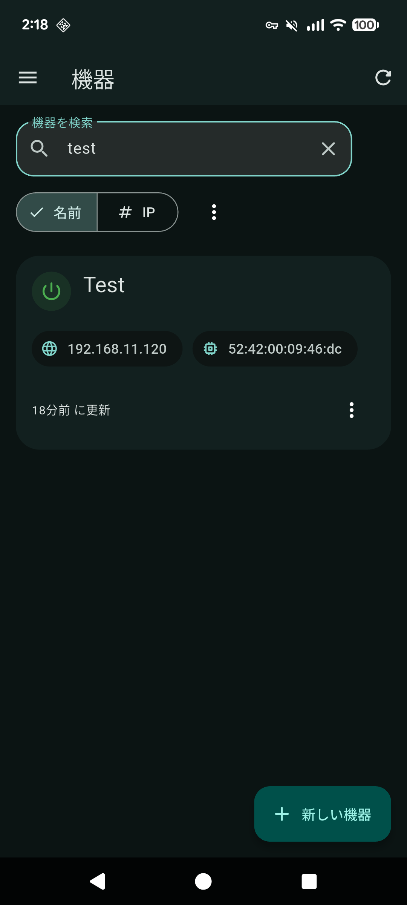
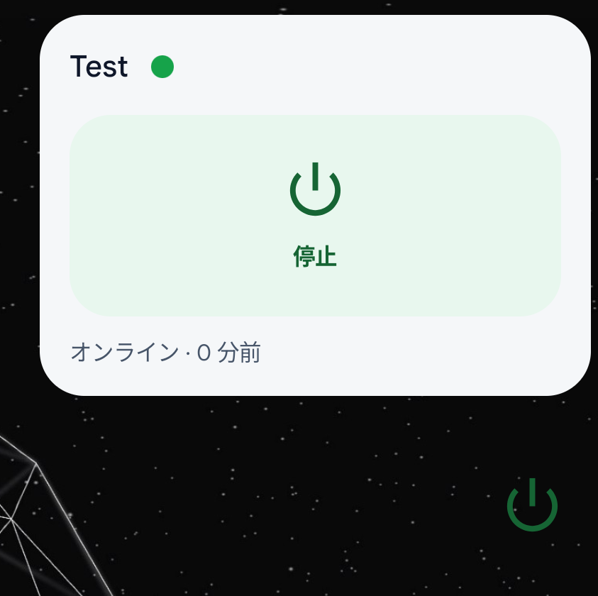

# UpSnap Flutter Client

[English README](README.md)

これは [UpSnap](https://github.com/seriousm4x/upsnap) の Flutter クライアントです。

## 機能

- Flutter アプリから UpSnap サーバーに接続
- デバイスの表示と管理
- モバイル向け UI で UpSnap を利用可能
- Android のホーム画面ウィジェットに対応

## スクリーンショット

	
	

左: アプリ画面。右: Android ウィジェット画面（大・小の2サイズ）。
